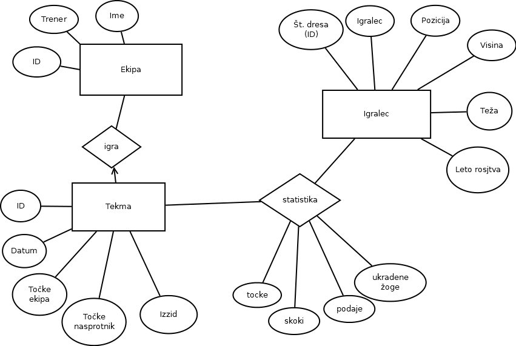

# Baza za kosarkarsko ekipo

Avtorja:
* Blaž Dobravec
* Dimitar Stoilkov

Seminarska naloga pri predmetu **Podatkovne baze 1**

## Opis

Baza bo hranila podatke o košarkaški ekipi, njihovih igralcih, njihovih točkah, poziciji, ipd. Baza bo namenjena evidenci uspešnosti vsakega od igralcev na bodisi posamezni tekmi, bodisi v celotni sezoni. Tabela se bo z vsako tekmo tekoče sezone posodabljala .

## ER diagram

